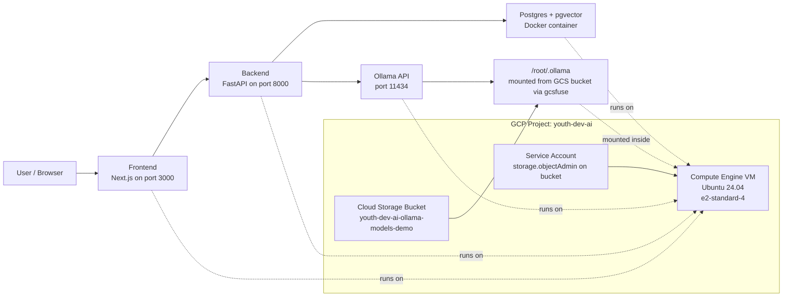

# AI Readiness Intelligence Studio

> **Tagline:** “From business documents to AI opportunity roadmap in minutes.”

AI Readiness Intelligence Studio is an AI Transformation Discovery Platform. It is designed to act as a virtual team of consultants, analysts, solution architects, proposal writers, and report compilers, enabling consulting firms, enterprise sales teams, and transformation leads to diagnose client environments instantly.

---

## Technical Architecture Highlight

1. **Stateful Multi-Agent Core**: Orchestrated using `LangGraph` across 9 nodes representing specialized agents processing state sequentially.
2. **LLM Adaptive Routing**: Automatically routes queries to **Groq** (`llama-3.3-70b-versatile`) as the primary intelligence layer when `GROQ_API_KEY` is set and `USE_OLLAMA=false`. Otherwise it runs locally on **Ollama** models (`qwen2.5:7b`, `llama3:8b`, `phi3.5:latest`) or high-fidelity mockup templates if offline.
3. **Dual Database Engine**: Attempts PostgreSQL + `pgvector` inside the container cluster and falls back to SQLite + a customized python-in-memory vector store on local developer machines instantly.
4. **Rich Exporters**: PDF (custom styled grids), DOCX (Word proposals), and PPTX (slide decks).

## GCP Demo Deployment Architecture

The Terraform-based GCP demo deployment uses a single Compute Engine VM and persists Ollama model data in a dedicated GCS bucket mounted with `gcsfuse`.



For this deployment path:

- `Frontend`, `Backend`, `Postgres`, and `Ollama` run as Docker containers on one Ubuntu VM.
- Ollama model files are not baked into the image; they are stored in GCS and mounted into the container at `/root/.ollama`.
- This keeps the Ollama image lightweight and lets model data survive VM recreation.
- The working demo-safe Ollama model set is `qwen2.5:7b` and `llama3:8b`.
- Groq is optional in this deployment. Set `groq_api_key` and switch `USE_OLLAMA=false` only if you want Groq to become the primary path.
- Important: with the current Terraform defaults, a full `terraform destroy` also deletes the bucket because it is still managed by Terraform with `force_destroy = true`. To preserve models, destroy only the VM resources or remove the bucket from the destroy scope.

---

## Getting Started

You can run this platform in two modes: **Pure Local (SQLite fallback)** or **Container Cluster (Docker Compose)**.

### Mode A: Pure Local Run (Recommended for instant testing)

#### 1. Start Backend Server
```bash
cd backend
python -m venv venv
source venv/bin/activate  # on Windows: venv\Scripts\activate
pip install -r requirements.txt
alembic upgrade head
uvicorn app.main:app --reload --host 0.0.0.0 --port 8000
```
*Exposes FastAPI endpoints at `http://localhost:8000`*

If you already have an older local `aireadiness.db` from the pre-Alembic builds, mark it once before switching to migrations:
```bash
alembic stamp head
```

#### 2. Start Next.js Frontend App
```bash
cd frontend
npm install
npm run dev
```
*Exposes Web App console at `http://localhost:3000`*

The frontend reads the backend URL from `NEXT_PUBLIC_API_URL`. If you run locally without Docker, use:
```bash
NEXT_PUBLIC_API_URL=http://localhost:8000/api/v1 npm run dev
```

Backend health checks:
```bash
curl -s http://localhost:8000/healthz
curl -s http://localhost:8000/readyz
```

If you are deploying to a hosted environment and do **not** want silent SQLite fallback, set:
```bash
REQUIRE_POSTGRES=true
```

To point Alembic at a different database during migrations, set:
```bash
ALEMBIC_DATABASE_URL=postgresql://...
```

---

### Mode B: Container Cluster (Docker Compose)
If you have Docker running:
```bash
docker-compose up --build
```
*Launches postgres database + pgvector, FastAPI server at port 8000, and Next.js at port 3000.*

---

## 7-Minute High-Impact Walkthrough Demo

1. Navigate to the web app: `http://localhost:3000`
2. Click **Load B2B Consulting Firm Demo** to bypass credentials and load a complete, pre-configured assessment dashboard for **Apex Global Consulting Partners**.
3. **Explore the Analysis Hub**:
   - **Executive Summary**: View the client brief summary.
   - **Process Bottlenecks**: See identified manual processes and AI potential levels.
   - **Opportunities Map**: Discover P1/P2 priorities grouped by department with evidence logs.
   - **Prioritization Grid**: Hover over use-cases positioned dynamically in the 2x2 Value-Complexity matrix.
   - **Readiness Scores**: Analyze the breakdown using Recharts radar and bar graphs.
   - **Risk Register**: Look at control checkpoints.
   - **Recommended Pilot**: View the highlighted proposal card featuring a custom confidence score.
   - **90-Day Roadmap**: Walk through the visual 3-phase timeline.
4. **Human Review Mode**: Toggle the checkbox in the sidebar. Click and override fields (e.g. edit description texts, update scores), click **Save Manual Edits**, and watch charts update instantly!
5. **Review and Approve**: Open **Human Review Mode**, finalize the client-facing summary, and set the assessment status to **Approved**.
6. **Download Assets**: Navigate to **Report Downloads** and click PDF, Word, or PowerPoint buttons to download fully rendered client deliverables on the spot.
